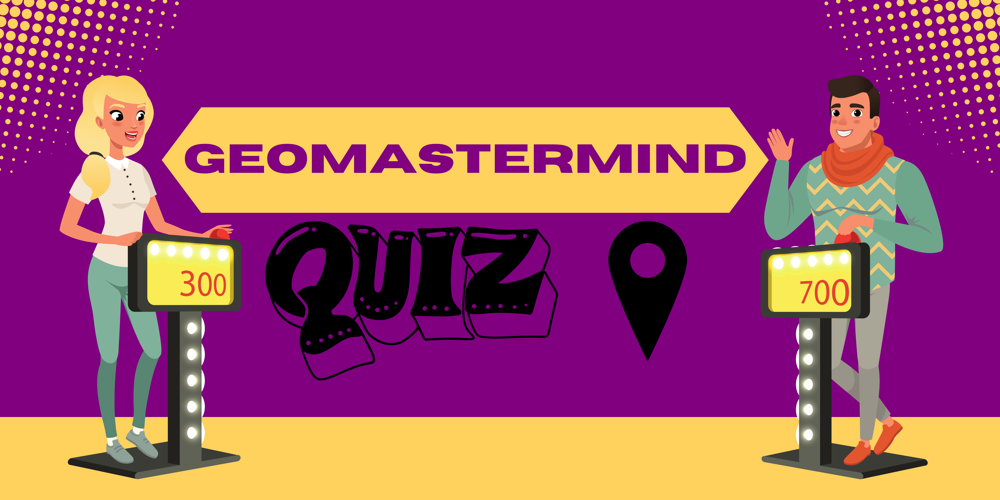
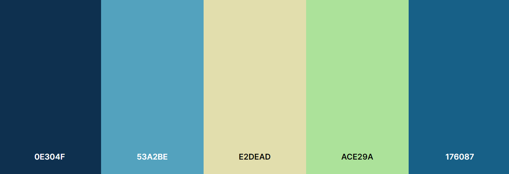

# geoMastermind 🔵

<b>Visit the deployed site:</b> [geoMastermind](https://kimbergstroem.github.io/PP2/)

Get ready to put your geography skills to the test with GeoMastermind! 

This exciting mini game, built with <b>JavaScript</b> as base and <b>HTML/CSS</b>, challenges you to answer ten questions about locations, landmarks, cultures, and more from around the world. 

With different levels of difficulty, you can compete against yourself or challenge your friends to see who can achieve the highest score. With its fun and engaging gameplay, <b>GeoMastermind</b> is the perfect way to learn more about the world and test your knowledge. Are you ready to become a <b>geoMastermind</b>?

---

## CONTENTS 🔵

* [User Experience](#user-experience-ux)
  * [User Stories](#user-stories)

* [Design](#design)
  * [Colour Scheme](#colour-scheme)
  * [Typography](#typography)
  * [Imagery](#imagery)
  * [Wireframes](#wireframes)

* [Features](#features)
  * [General Features on Each Page](#general-features-on-each-page)
  * [Future Implementations](#future-implementations)
  * [Accessibility](#accessibility)

* [Technologies Used](#technologies-used)
  * [Languages Used](#languages-used)
  * [Frameworks, Libraries & Programs Used](#frameworks-libraries--programs-used)

* [Deployment & Local Development](#deployment--local-development)
  * [Deployment](#deployment)
  * [Local Development](#local-development)
    * [How to Fork](#how-to-fork)
    * [How to Clone](#how-to-clone)

* [Testing](#testing)
  * [Functionality Testing](#Bugs)
  * [Bugs](#Bugs)
  * [Validation](#Validation)

* [Credits](#credits)
  * [Code Used](#code-used)
  * [Content](#content)
  * [Media](#media)
  * [Acknowledgments](#acknowledgments)

---

## User Experience (UX) 🔵

#### Key information for the site

### User Stories 🔹

#### Client Goals

#### First Time Visitor Goals

#### Returning Visitor Goals

#### Frequent Visitor Goals

(<a href="#readme-top">back to top</a>)

--- 

## Design 🔵

### Colour Scheme 🔹

We wanted to choose colours that reflected the environment of the universum, so we have chosen a variety of Blue(<b>water</b>), Green(<b>nature</b>) and Yellow(<b>sun</b>) for our site.

This colors are going to be implemented as <b>60-30-10</b> rule with the base of the color #0E304F. We want to have a more dark theme on the website, along with the light colors.

The colour palette was created using the [Coolors website](https://coolors.co/aeffd8-8affc1-8fdc97-ac8887-9f4a54).

### Typography 🔹

Google Fonts was used for the following fonts:

* "Lato" is used for headings and bigger content on the site. It is a sans serif typeface family.

* "Nunito" is used for the body text, paragraphs which are the questions and answer. Nunito is a sans-serif typeface designed by Vernon Adams. It has a rounded, friendly and modern style, and its letterforms are clean and legible.

### Imagery 🔹

All the images displayed in this site was originelly downloaded by the sites below, and modified in Photoshop.

### Wireframes 🔹

Wireframes were created for mobile and desktop. I used the webbapplication called [Balsamiq](https://balsamiq.cloud/suu74na/psiivfn/r6B57) for creating the wireframes for webbapplication <b>geoMastermind</b>.

Click on the links below to see an large seperated image of each page.

[Home Page](assets/readme/wireframes/wireframeIndex.png)

[HighScore Page](assets/readme/wireframes/wireframeHighscore.png)

[Game Page](assets/readme/wireframes/wireframeGame.png)

[Mobile Version Design](assets/readme/wireframes/wireframeMobile.png)

(<a href="#readme-top">back to top</a>)

--- 

## Features 🔵

### Accessibility 🔹

I have been mindful during coding to ensure that the website is as accessible friendly as possible. I have achieved this by:

* Using semantic HTML elements as, header(), section(), nav().
* Declare the Language in the beginning of every html page.
* Using descriptive ALT attributes on images and links on the site.
* Using a hover state on all buttons on the site to make it clear to the user if they are hovering over a button or not.
* Providing information for screen readers where there are icons used and no text.
* Ensuring that there is a sufficient colour contrast throughout the site.
* Ensuring menus are accessible by marking the current page as current for screen readers.

(<a href="#readme-top">back to top</a>)

--- 

## Technologies Used 🔵

### Languages Used 🔹

Hyper Text Markup Language (<b>HTML</b>), Cascading Style Sheets (<b>CSS</b>) and Javascript (<b>JS</b>) were used to create this website.

### Frameworks, Libraries & Programs Used 🔹

[Balsamiq](https://balsamiq.cloud/) - Used to create wireframes.

[Git](https://git-scm.com/) - For version control. Which my profiles hours was ended and i needed to upload the last commits by github, therfore my commit message and description isnt good enough at the end.

[Github](https://www.github.com/) - To save and store the files for the website.

[Google Fonts](https://fonts.google.com/) - To import the fonts used on the website.

[Font Awesome](https://fontawesome.com/) - For the iconography on the website.

Google Dev Tools (Google Browser) - To troubleshoot and test features, solve issues with responsiveness and styling.

[Tiny PNG](https://tinypng.com/) To compress images.

[Favicon.io](https://favicon.io/) To create favicon.

[Am I Responsive?](http://ami.responsivedesign.is/) To show the website image on a range of devices.

[Shields.io](https://shields.io/) To add badges to the README

(<a href="#readme-top">back to top</a>)

--- 

## Deployment & Local Development 🔵

Github Pages was used to deploy the live website. The instructions to achieve this are below:

1. Log in (or sign up) to Github.com.
2. Find the repository for this project, "PP2".
3. Click on the Settings link.
4. Click on the Pages link in the left hand side navigation bar.
5. In the Source section, choose main from the drop down select branch menu. Select Root from the drop down select folder menu.
6. Click Save. Your live Github Pages site is now deployed at the URL shown.

### Local Development 🔹

#### How to Fork

To fork the PP1 repository:

1. Log in (or sign up) to Github.
2. Go to the repository for this project, https://github.com/KimBergstroem/PP2.
3. Click the Fork button in the top right corner.

#### How to Clone

To clone the PP1 repository:

1. Log in (or sign up) to GitHub.
2. Go to the repository for this project, https://github.com/KimBergstroem/PP2.
3. Click on the code button, select whether you would like to clone with HTTPS, SSH or GitHub CLI and copy the link shown.
4. Open the terminal in your code editor and change the current working directory to the location you want to use for the cloned directory.
5. Type 'git clone' into the terminal and then paste the link you copied in step 3. Press enter.

(<a href="#readme-top">back to top</a>)

--- 

## Testing 🔵

### Functionality Testing 🔹

### Buggs 🔹

### Validation 🔹

#### W3C Validator

#### Lighthouse Report

#### Contrast checker - WebAIM

#### Full Testing

(<a href="#readme-top">back to top</a>)

--- 

## Credits 🔵

### Code Used 🔹

### Content 🔹

###  Media 🔹

  
###  Acknowledgments 🔹

(<a href="#readme-top">back to top</a>)

--- 

