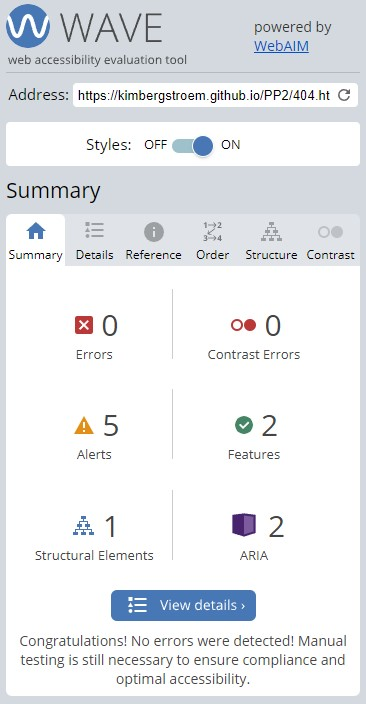
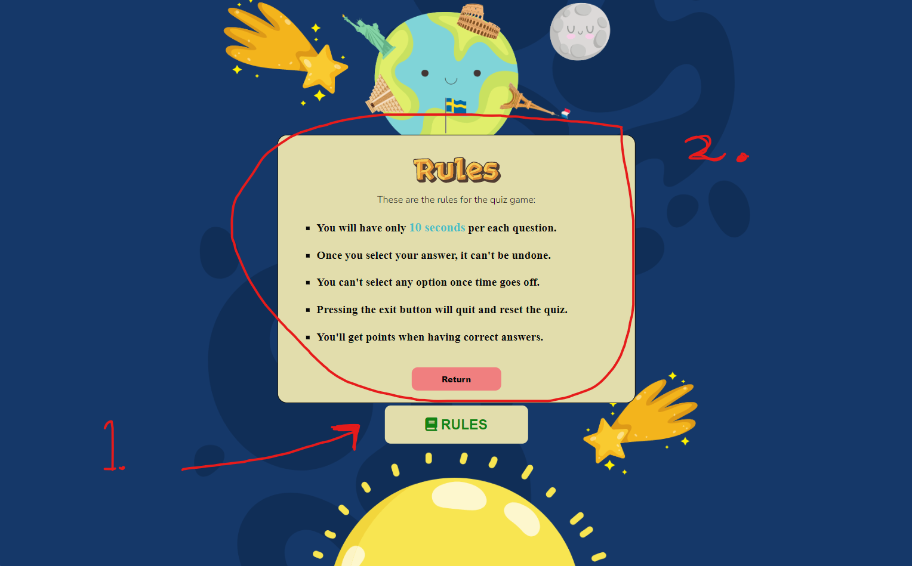
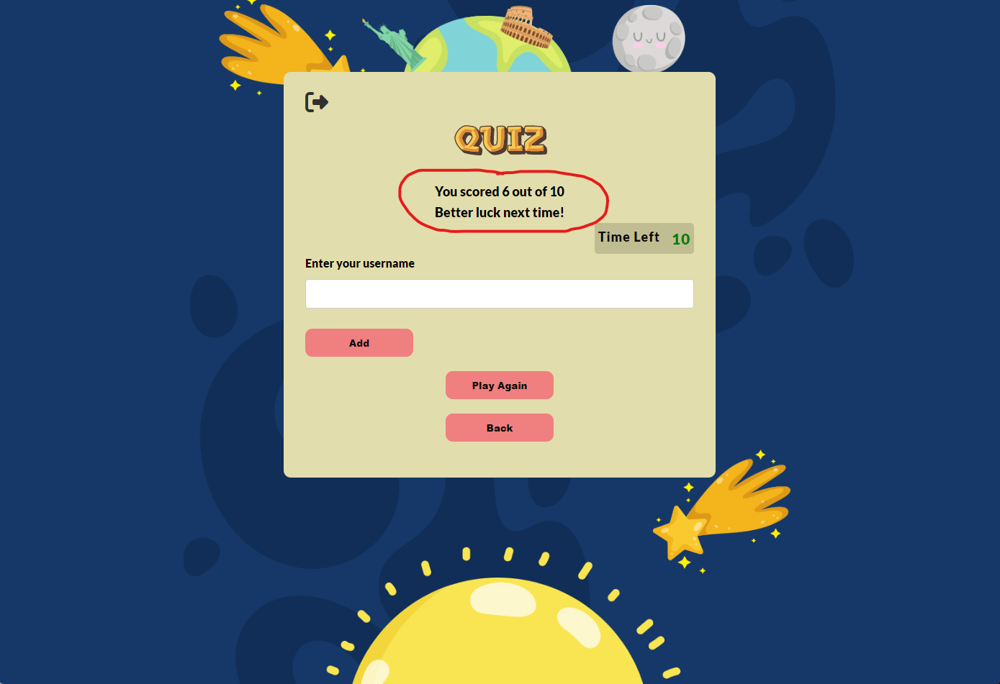

# geoMastermind Testing 

[View Live site here](https://kimbergstroem.github.io/PP2/)

[View Live site responsive here](https://ui.dev/amiresponsive?url=https://kimbergstroem.github.io/PP2/)

---

## CONTENTS

* [**Automated Testing**](#automated-testing)
  * [W3C Validator](#w3c-validator)
  * [JavaScript Validator](#javaScript-validator)
  * [Lighthouse](#lighthouse)
  * [Wave Accessibility Test](#wave)
* [**Manual Testing**](#manual-testing)
  * [Testing User Stories](#testing-user-stories)
  * [Full Testing](#full-testing)

---

**Throughout the game development process, I relied on Google Developer Tools to experiment with different elements and phases of the game. Additionally, I leveraged the console section in Chrome Dev Tools to test JavaScript code and address any problems or glitches that occurred in the code.**

---

## **Automated Testing**

The W3C validator was used to validate the HTML on all pages of the website and the STYLESHEET in css file. JSHint was used to validate all my javascript files used for this project. Click on the below links to have the full validation. No error was found.

### **W3C Validator** 

* [W3C validation for **index.html**](https://validator.w3.org/nu/?doc=https%3A%2F%2Fkimbergstroem.github.io%2FPP2%2Findex.html)
   
* [W3C validation for **404.html**](https://validator.w3.org/nu/?doc=https%3A%2F%2Fkimbergstroem.github.io%2FPP2%2F404.html)
   
* [Jigsaw W3C Validation for **style.css**](https://jigsaw.w3.org/css-validator/validator?uri=https%3A%2F%2Fkimbergstroem.github.io%2FPP2%2Fassets%2Fcss%2Fstyle.css&profile=css3svg&usermedium=all&warning=1&vextwarning=&lang=en) 
   

### **JavaScript Validator** 

The code was passed through JSHint for testing, and no errors were found. Additionally, various metrics were returned, including the number of functions, the size of the largest function, and the complexity of the most complex function.

* [Js Hint validation for **main.js**](https://jshint.com/) 
  
* [Js Hint validation for **popup.js**](https://jshint.com/)
  

### **Lighthouse** 

index.html

  * [index.html lighthouse desktop](https://googlechrome.github.io/lighthouse/viewer/?psiurl=https%3A%2F%2Fkimbergstroem.github.io%2FPP2%2F&strategy=mobile&category=performance&category=accessibility&category=best-practices&category=seo&category=pwa&utm_source=lh-chrome-ext)
    

    
  * [index.html lighthouse mobile](https://googlechrome.github.io/lighthouse/viewer/?psiurl=https%3A%2F%2Fkimbergstroem.github.io%2FPP2%2F&strategy=mobile&category=performance&category=accessibility&category=best-practices&category=seo&category=pwa&utm_source=lh-chrome-ext)
    

404.html
  * [404.html lighthouse desktop](https://googlechrome.github.io/lighthouse/viewer/?psiurl=https%3A%2F%2Fkimbergstroem.github.io%2FPP2%2F&strategy=mobile&category=performance&category=accessibility&category=best-practices&category=seo&category=pwa&utm_source=lh-chrome-ext)
    

    
  * [404.html lighthouse mobile](https://googlechrome.github.io/lighthouse/viewer/?psiurl=https%3A%2F%2Fkimbergstroem.github.io%2FPP2%2F&strategy=mobile&category=performance&category=accessibility&category=best-practices&category=seo&category=pwa&utm_source=lh-chrome-ext)
    

### **Wave**

To check the color contrast ratio between foreground and background elements, ensuring that the website is accessible to all users, including those with visual impairments. No errors or contrast error was found.

* [index.html Wave Contrast checker](https://wave.webaim.org/report#/https://kimbergstroem.github.io/PP2/)

    

* [404.html Wave Contrast checker](https://wave.webaim.org/report#/https://kimbergstroem.github.io/PP2/404.html)

    

---

## **Manual Testing**

### **Testing User Stories**

`First Time Visitors`

|First Time User Goals| How this was achieved| Screenshot|
| :--- | :--- | :--- | 
| As a user, my objective is to discover the instructions on how to play the game in order to enhance my gameplay efficiency.| The game has a "rules" page popup which can be seen when you click on "rules" button on the main page.| 

Screenshot of result

|
| As a user, I desire the ability to validate the correctness of my answers, thereby increasing my score| When a user clicks on the answer buttons, a visual indication is provided by changing the color of the button. If the selected answer is correct, the button turns green; otherwise, it turns red.| 

Screenshot of result

| 
| As a user, I would like to have visibility of the remaining time so that I can maintain a suitable pace during gameplay and avoid running out of time.| The user is provided with a countdown timer that is visible during their gameplay. The countdown timer is also displaying different color depending on the urgency of time left.| 

Screenshot of result

| 
| As a user, I would like to view my final score at the end of the game in order to the scoreboard and dashbaord| Upon completion of the game, the user is presented with their score along with a performance message that reflects their performance, varying based on how well or poorly they performed.| 

Screenshot of result

|
|As a user, I want to be able to cancel the game anytime during the play if not want to continue| Upon completion of the game, the user is presented with a quit icon displaying in the upper right corner of the quiz game. By pressing this icon, it takes the user back to main menu, existing and reseting the game.| 

Screenshot of result

|
|

`Returning Visitors`

|Returning User Goals| How this was achieved|
| :--- | :--- |
| More information is coming| More information is coming|
| More information is coming| More information is coming| 

---
### **Full Testing**

Full Testing was performed on these devices and browsers for each section of game. 
I have utilized the Google Chrome Developer Tools and the Inspector tool to meticulously examine every page, ensuring their responsiveness across various screen sizes and devices.

**Devices**

<ins>Mobile</ins>
1. Samsung s22 ultra 
2. Iphone X 
3. Samsung galaxy s22
4. Iphone 14 pro max

<ins>Desktop</ins>
1. Samsung galaxy book 360
2. HP elite book 830 g9
3. HP victus gaming desktop

<ins>Monitors</ins>
1. 49 inch Samsung CHG9 ultra wide
2. 27 inch Benq zowie XL2746S
3. 27 inch Dell ultrasharp U2723QE

<ins>Browsers</ins>
1. Microsoft Edge
2. Google Chrome 	
3. Mozilla firefox 	
4. Safari

&nbsp;

I also asked family and friends to test my game on their devices no issues were reported.

The scores below are the average results obtained from three users who attempted the following.
 
|Test|Result  |
|--|--|
|Read the rules to understand the game|**100%**|
|Click on start button and complete the game |**100%**  |
|Click on play again button |**100%**|
|Navigate to highscore dashboard and check the board|**100%**|
|Enter a username after completing the game and receive thank you message|**100%**|

&nbsp;

`Home Page Section` 

| Feature | Expected Outcome | Testing Performed | Result | Pass/Fail |
| --- | --- | --- | --- | --- |
| Play button | Redirects the user to the game page and initiates the game | Clicked on the button | Game page opens and the quiz game starts | ✅ |
| High scores button | Redirects the user to the high score page | Clicked on the button | Successfully directed to the high scores page | ✅ |
| Rules button | Opens a popup window with rule instructions | Clicked on the button | Rule page/box opens and displays the rules | ✅ |
| All buttons - hover effect | When hovered over, all light yellow buttons with green text should change to dark yellow with green text | Hovered over each button on the page | Each button displayed the correct style when hovered over | ✅ |
| Cursor | The cursor should change when the user moves the mouse over a button | Moved the mouse over each button to check for cursor changes | The cursor changed from the arrow cursor to the clickable hand cursor | ✅ |

`Game Page Section`

| Feature | Expected Outcome | Testing Performed | Result | Pass/Fail |
| --- | --- | --- | --- | --- |
| Exit game icon | The link should direct the user back to the home page and exit the game | Clicked on the icon | Successfully directed back to the home page and the quiz restarted | ✅ |
| All buttons - hover effect | When hovered over, buttons with a red background and black text should change to a dark red background with black text | Hovered over each button on the page | Each button displayed the correct style when hovered over | ✅ |
| Cursor | The clickable hand cursor should appear when the user moves the mouse over a button | Moved the mouse over each button to check for cursor changes | The cursor changed from the arrow cursor to the clickable hand cursor | ✅ |
| Question display | The questions should be correctly pulled from the JavaScript file and displayed in the correct order | Checked the data using console.log and verified the questions were pulled correctly | The questions are displaying in the correct order | ✅ |
| Correct answer - button colour | When a correct answer is clicked, the button background should change to green | Clicked on a correct answer | The button background turned green | ✅ |
| Incorrect answer - button colour | When an incorrect answer is clicked, the clicked button's background should turn red | Clicked on an incorrect answer | The button background turned red | ✅ |
| Incorrect answer - display correct answer | When an incorrect answer is clicked, the correct answer should be displayed with a green background | Clicked on an incorrect answer | The correct answer turned green | ✅ |
| Score Counter | The score counter should start at 0. Each time a correct answer is selected, the score should increase by 1. If an incorrect answer is selected, the score should remain the same | Clicked on a correct answer to check if the score increased. Clicked on an incorrect answer to check if the score remained the same | The score increased by 1 when a correct answer was selected. The score remained the same when an incorrect answer was selected | ✅ |
| Not Allowed Cursor | Once an answer has been selected, the answer buttons should be disabled and show the not allowed cursor when hovered over | Clicked on one answer button and then clicked on the remaining answer buttons | After selecting an answer, each subsequent answer button displayed the not allowed cursor when hovered over | ✅ |
| Next button - becomes visible | When an answer is clicked, the next button should be displayed to allow the user to progress to the next question or to the end section if all 10 questions have been answered | Clicked on an answer button | The next button was displayed | ✅ |
| Next button - clicked | When clicked, all answer styles should be removed, the next button should be hidden again, and a new question and set of answers should be loaded if there are remaining questions. If all questions have been answered, the end game should be displayed | Clicked on the next button | All styles were removed, a new question and answers were displayed. After answering question 10, I was taken to the score page | ✅ |

`Show score Section`

| Feature | Expected Outcome | Testing Performed | Result | Pass/Fail |
| --- | --- | --- | --- | --- |
| Exit game icon | Link direct the user back to the home page and exit the game | Clicked button icon | Directed back to home page and restarted the quiz | ✅ |
| All buttons - hover effect | All buttons with a red background & black text should change when hovered over to a background colour of dark red with black text. | Hover over each button on the page | Each button displayed the correct styling when hovered over | ✅ |
| Cursor | The clickable hand should display when a user moves the mouse over a button | Moved the mouse over each button to check the cursor changed upon entering the button | The cursor changed from the arrow cursor to the clickable hand cursor | ✅ |
| Score Display | The Your Score area should populate with the score you have achieved along with a funny message depends on the score | I added my score as I played, checked the score on the last question & compared to the score displayed | The score displays correctly with funny message | ✅ |
| Submit Button | The submit button should only work once the user put their username into the input field | I hovered over and clicked the submit button without filling in the username field. I then added a username, hovered over and clicked the submit button | Without a username filled in the cursor displays a required message that a username is missing. Once I filled in a username I was able to click and submit the score | ✅ |
| Submit button - on submit | Once clicked on the submit button, text message will display "Your username and score has been added!" | Clicked the button with the username filled in | Correct text message is diplayed | ✅ |
| Play again? button | Clicking on this button will return you to the start of the quiz game again | Clicked on the play again? button | Directed to the beginning of the game and first question is showed | ✅ |
| Back button | Clicking on this button will take you back to the home page | Clicked the back button | Directed back to the home page | ✅ |

`Highscore Section`

| Feature | Expected Outcome | Testing Performed | Result | Pass/Fail |
| --- | --- | --- | --- | --- |
| Exit game icon | Link direct the user back to the home page and exit the game | Clicked button icon | Directed back to home page and restarted the quiz | ✅ |
| All buttons - hover effect | All buttons with a red background & black text should change when hovered over to a background colour of dark red with black text. | Hover over each button on the page | Each button displayed the correct styling when hovered over | ✅ |
| Cursor | The clickable hand should display when a user moves the mouse over a button | Moved the mouse over each button to check the cursor changed upon entering the button | The cursor changed from the arrow cursor to the clickable hand cursor | ✅ |
| Score Displayed | Your latest attempt will be displayed with your username and score along other users added username and score | Played 5+ games and logged a variety of scores and username. | The attempts and username + score is visible in the highscore page | ✅ |
| Back button | Clicking on this button will take you back to the home page | Clicked the back button | Directed back to the home page | ✅ |

`Rules Section`

| Feature | Expected Outcome | Testing Performed | Result | Pass/Fail |
| --- | --- | --- | --- | --- |
| All buttons - hover effect | All buttons with a red background & black text should change when hovered over to a background colour of dark red with black text. | Hover over each button on the page | Each button displayed the correct styling when hovered over | ✅ |
| Cursor | The clickable hand should display when a user moves the mouse over a button | Moved the mouse over each button to check the cursor changed upon entering the button | The cursor changed from the arrow cursor to the clickable hand cursor | ✅ |
| Return button | Takes the user back to the home page | Clicked the button | Taken to the home page | ✅ |

`404 Page`

| Feature | Expected Outcome | Testing Performed | Result | Pass/Fail |
| --- | --- | --- | --- | --- |
| All buttons - hover effect | All buttons with a red background & black text should change when hovered over to a background colour of dark red with black text. | Hover over each button on the page | Each button displayed the correct styling when hovered over | ✅ |
| Cursor | The clickable hand should display when a user moves the mouse over a button | Moved the mouse over each button to check the cursor changed upon entering the button | The cursor changed from the arrow cursor to the clickable hand cursor | ✅ |
| Return home button | Takes the user back to the home page | Clicked the button | Taken to the home page | ✅ |

