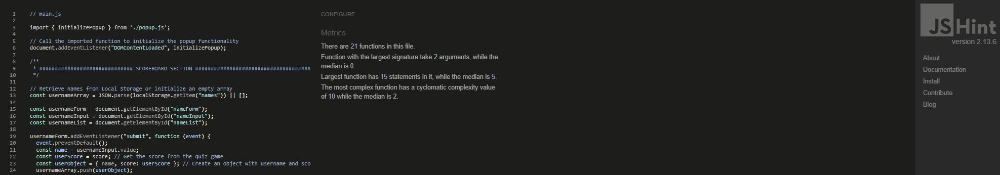
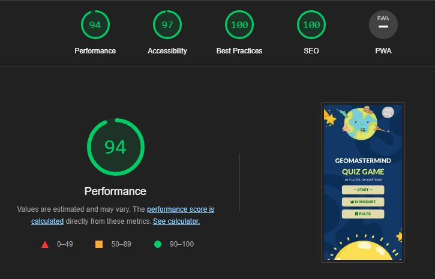
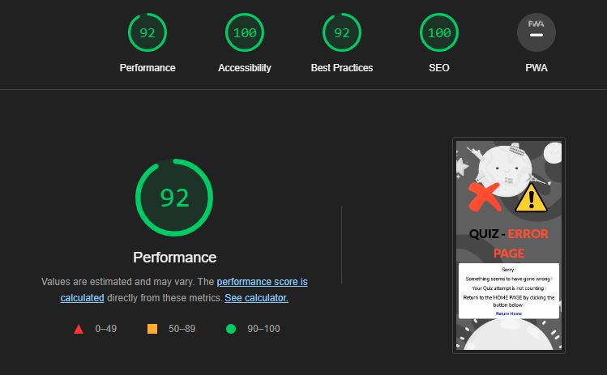

# geoMastermind Testing 

[View Live site here](https://kimbergstroem.github.io/PP2/)

[View Live site responsive here](https://ui.dev/amiresponsive?url=https://kimbergstroem.github.io/PP2/)

---

## CONTENTS

* [**Automated Testing**](#automated-testing)
  * [W3C Validator](#w3c-validator)
  * [JavaScript Validator](#javaScript-validator)
  * [Lighthouse](#lighthouse)
  * [Wave Accessibility Test](#wave)
* [**Manual Testing**](#manual-testing)
  * [Testing User Stories](#testing-user-stories)
  * [Full Testing](#full-testing)

---

**Throughout the game development process, I relied on Google Developer Tools to experiment with different elements and phases of the game. Additionally, I leveraged the console section in Chrome Dev Tools to test JavaScript code and address any problems or glitches that occurred in the code.**

---

## **Automated Testing**

The W3C validator was used to validate the HTML on all pages of the website and the STYLESHEET in css file. JSHint was used to validate all my javascript files used for this project. Click on the below links to have the full validation. No error was found.

### **W3C Validator** 

* [W3C validation for **index.html**](https://validator.w3.org/nu/?doc=https%3A%2F%2Fkimbergstroem.github.io%2FPP2%2Findex.html)
   
* [W3C validation for **404.html**](https://validator.w3.org/nu/?doc=https%3A%2F%2Fkimbergstroem.github.io%2FPP2%2F404.html)
   
* [Jigsaw W3C Validation for **style.css**](https://jigsaw.w3.org/css-validator/validator?uri=https%3A%2F%2Fkimbergstroem.github.io%2FPP2%2Fassets%2Fcss%2Fstyle.css&profile=css3svg&usermedium=all&warning=1&vextwarning=&lang=en) 
   

### **JavaScript Validator** 

The code was passed through JSHint for testing, and no errors were found. Additionally, various metrics were returned, including the number of functions, the size of the largest function, and the complexity of the most complex function.

* [Js Hint validation for **main.js**](https://jshint.com/) 
  
* [Js Hint validation for **popup.js**](https://jshint.com/)
  

### **Lighthouse** 

index.html

  * [index.html lighthouse desktop](https://googlechrome.github.io/lighthouse/viewer/?psiurl=https%3A%2F%2Fkimbergstroem.github.io%2FPP2%2F&strategy=mobile&category=performance&category=accessibility&category=best-practices&category=seo&category=pwa&utm_source=lh-chrome-ext)
    

    
  * [index.html lighthouse mobile](https://googlechrome.github.io/lighthouse/viewer/?psiurl=https%3A%2F%2Fkimbergstroem.github.io%2FPP2%2F&strategy=mobile&category=performance&category=accessibility&category=best-practices&category=seo&category=pwa&utm_source=lh-chrome-ext)
    

404.html
  * [404.html lighthouse desktop](https://googlechrome.github.io/lighthouse/viewer/?psiurl=https%3A%2F%2Fkimbergstroem.github.io%2FPP2%2F&strategy=mobile&category=performance&category=accessibility&category=best-practices&category=seo&category=pwa&utm_source=lh-chrome-ext)
    

    
  * [404.html lighthouse mobile](https://googlechrome.github.io/lighthouse/viewer/?psiurl=https%3A%2F%2Fkimbergstroem.github.io%2FPP2%2F&strategy=mobile&category=performance&category=accessibility&category=best-practices&category=seo&category=pwa&utm_source=lh-chrome-ext)
    

### **Wave**

What was testet - Coming soon
* Coming soon

---

## **Manual Testing**

### **Testing User Stories**

**First Time Visitors** 

|First Time User Goals| How this was achieved|
| :--- | :--- |
| As a user, my objective is to discover the instructions on how to play the game in order to enhance my gameplay efficiency.| The game has a "rules" page popup which can be seen when you click on "rules" button on the main page.| 
| As a user, I desire the ability to validate the correctness of my answers, thereby increasing my score| When a user clicks on the answer buttons, a visual indication is provided by changing the color of the button. If the selected answer is correct, the button turns green; otherwise, it turns red.| 
| As a user, I would like to have visibility of the remaining time so that I can maintain a suitable pace during gameplay and avoid running out of time.| The user is provided with a countdown timer that is visible during their gameplay. The countdown timer is also displaying different color depending on the urgency of time left.|  
| As a user, I would like to view my final score at the end of the game in order to the scoreboard and dashbaord| Upon completion of the game, the user is presented with their score along with a performance message that reflects their performance, varying based on how well or poorly they performed.|
|As a user, I want to be able to cancel the game anytime during the play if not want to continue| Upon completion of the game, the user is presented with a quit icon displaying in the upper right corner of the quiz game. By pressing this icon, it takes the user back to main menu, existing and reseting the game.|
|

**Returning Visitors**

|Returning User Goals| How this was achieved|
| :--- | :--- |
| More information is coming| More information is coming|
| More information is coming| More information is coming| 

---
### **Full Testing**

Full Testing was performed on these devices and browsers for each section of game 

**Devices** 
1. Coming soon
2. Coming soon
3. Coming soon
4. Coming soon

**Browsers** 
1. Microsoft Edge - Examples
2. Google Chrome - Examples	
3. Mozilla firefox - Examples	
4. Safari - Examples

I also asked family and friends to test my game on their devices no issues were reported in game except for background video not always playing in IOS devices(I noted this in Known Bugs) 

`Home Page Section` 

|Features|Expected result| Actual result| Pass/Fail | 
| ------ | ------------- | ------------ | --------- |
| More information is coming| More information is coming | Pass |
|More information is coming| More information is coming|  More information is coming| Pass|
| More information is coming | More information is coming | More information is coming | Pass |
|More information is coming | More information is coming | More information is coming|  Pass |  
| More information is coming | More information is coming| More information is coming | pass |
| More information is coming| More information is coming | More information is coming | Pass |

`Quiz/Game Page Section`

|Features|Expected result| Actual result| Pass/Fail | 
| ------ | ------------- | ------------ | --------- |
| More information is coming| More information is coming | Pass |
|More information is coming| More information is coming|  More information is coming| Pass|
| More information is coming | More information is coming | More information is coming | Pass |
|More information is coming | More information is coming | More information is coming|  Pass |  
| More information is coming | More information is coming| More information is coming | pass |
| More information is coming| More information is coming | More information is coming | Pass |

`Highscore Section`

|Features|Expected result| Actual result| Pass/Fail | 
| ------ | ------------- | ------------ | --------- |
| More information is coming| More information is coming | Pass |
|More information is coming| More information is coming|  More information is coming| Pass|
| More information is coming | More information is coming | More information is coming | Pass |
|More information is coming | More information is coming | More information is coming|  Pass |  
| More information is coming | More information is coming| More information is coming | pass |
| More information is coming| More information is coming | More information is coming | Pass |

`Rules Section`

|Features|Expected result| Actual result| Pass/Fail | 
| ------ | ------------- | ------------ | --------- |
| More information is coming| More information is coming | Pass |
|More information is coming| More information is coming|  More information is coming| Pass|
| More information is coming | More information is coming | More information is coming | Pass |
|More information is coming | More information is coming | More information is coming|  Pass |  
| More information is coming | More information is coming| More information is coming | pass |
| More information is coming| More information is coming | More information is coming | Pass |

`404 Page`

|Features|Expected result| Actual result| Pass/Fail | 
| ------ | ------------- | ------------ | --------- |
| More information is coming| More information is coming | Pass |
|More information is coming| More information is coming|  More information is coming| Pass|
| More information is coming | More information is coming | More information is coming | Pass |
|More information is coming | More information is coming | More information is coming|  Pass |  
| More information is coming | More information is coming| More information is coming | pass |
| More information is coming| More information is coming | More information is coming | Pass |